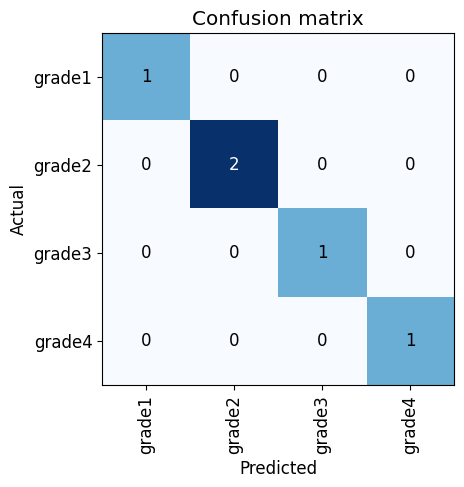
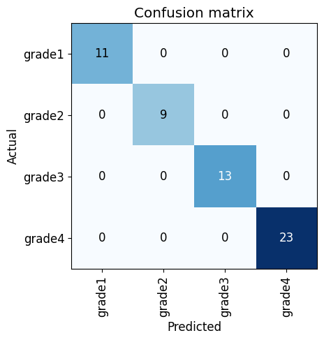

## Chili Grade Classification (Python)

This repo contains implemetation of Chili Grade Classification built using Python

Follow Fastai_ChiliGrade_classifier.ipynb file for training and inference purpose. Requirements of the project is also mentioned in given jupyter notebook.

### Training details

- Batch-size  : 4
- GPU provide : Colab
- GPU model   : Tesla t4
- Epochs      : 430

Model is overfitted as there is not enough dataset to make a generaised dataset but accuracy is 100 percent on 5% validation set.

# Validation set Confusion matrix (5% of dataset)

# Confusion matrix on 50% of complete dataset

## Notes

To prevent underfiting we can add augumentations of different kind to balance the dataset and to generate more samples.